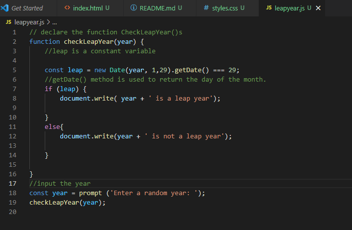

The program above checks on the month of February if it contains 29 days.

A year is a leap year if the following conditions are satisfied:

        The year is a multiple of 400.
        The year is a multiple of 4 and not a multiple of 100.

The code block  checks ifthe month of February contains 29 days the it is a Leap year other wise it is not.
